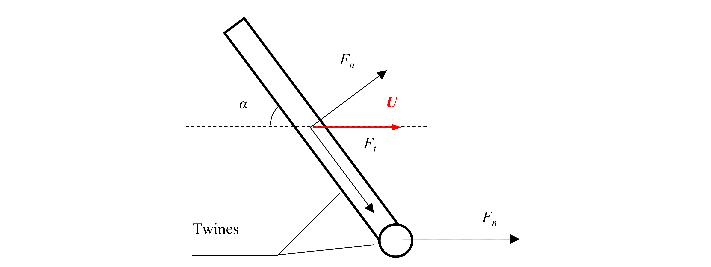

## One dimensional hydrodynamic model

### Explanations of model

For the one dimensional hydrodynamic models, the forces on netting are calculated based on individual twines. The twines are taken as a cylindrical elements. In practice, the force is usually decomposed into two components: normal drag force $F_n$ and tangential drag force $F_t$ (Cheng *et al*., 2020)



$
\boldsymbol{F}_{t}=0.5 C_{t} \rho_{w} d_{w}L\left|\boldsymbol{U}-\boldsymbol{v}\right|^{2} \boldsymbol{i}_{\boldsymbol{t}}
\\
\boldsymbol{F}_{n}=0.5 C_{n} \rho_{w} d_{w}L\left|\boldsymbol{U}-\boldsymbol{v}\right|^{2} \boldsymbol{i}_{\boldsymbol{n}}
$

* $\rho_{w}$ is the fluid density.

* $d_w$ is diameter of the cylindrical element.

* $L$ is the length of the cylindrical element.

* $\boldsymbol{U}$ is the undisturbed incoming flow velocity in the upstream of the net panel.

* $\boldsymbol{v}$ is the velocity of the structure.

* The unit vectors $\boldsymbol{i_n}$ and $\boldsymbol{i_t}$ which are used to indicate the directions of forces are defined by the following equations ($\boldsymbol{e_i}$ is the unit vector of the cylindrical element):

$$
\begin{gathered}

\boldsymbol{i_t}=\frac{(\boldsymbol{U-v})\boldsymbol{e_i}}{\left|\boldsymbol{U-v}\right|} \boldsymbol{e_i}
\\

\boldsymbol{i}_{n}=\frac{(\boldsymbol{U-v})}{\left|\boldsymbol{U-v}\right|}-\boldsymbol{i_t}
\end{gathered}
$$

* $C_n$ and $C_t$ are the normal drag and tangential force coefficients in the one dimension hydrodynamic models, respectively. These force coefficients are usually obtained from experiments that approximate the ideal conditions of a cylinder in an infinite flow field.

### How to implement in code

Example code:
``` python
import hydroModules as hdm

rope = hdm.one_dimensional.line("M4",
                                meshinfo['Lines_rope'],
                                0,
                                caseinfo['Frame']['rope_sec_dia'],
                                caseinfo['Frame']['rope_sec_dia'])
```

> **model_index**: [string] Unit: [-]. To indicate the model function, e.g.: 'M1', 'M2', 'M3'.
>
> **hydro_element**: [list] Unit: [-]. A python list to indicate how the lines are connected.
>
> **solidity**: [float] Unit: [-]. The solidity of netting.
>
> **dw0**: [float] Unit: [m]. The diameter of the physical net twines. It is used for the hydrodynamic coefficients.
> 
> **dwh**: [float] Unit: [m]. The hydrodynamic diameter of the numerical net twines. It is used for the force calculation (reference area).

