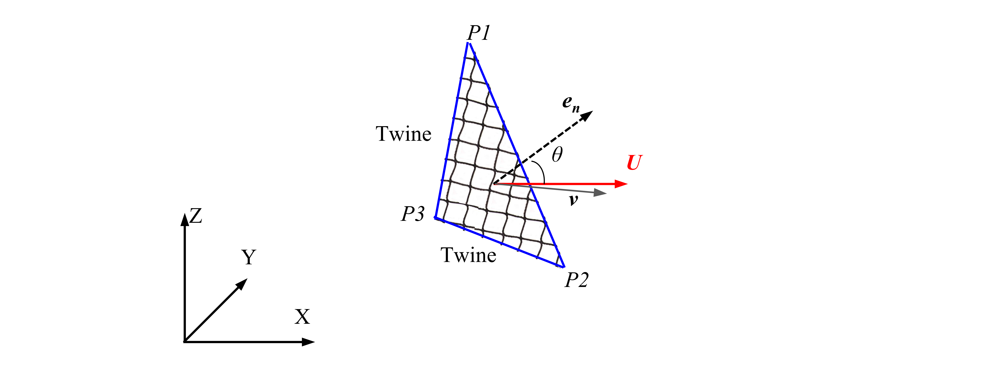

## Two dimensional hydrodynamic model

### Explanations of model 

For the two dimensional hydrodynamic models, the forces on netting are calculated based on individual a virtual net panel of netting. The twines and knots in the net panel are considered as an integrated structure. In this module, the net panel is defined by three nodes because three (non-collinear) points can determine a unique plane in Euclidean geometry. In practice, the force is usually decomposed into two components: drag force $\boldsymbol{F_D}$ and lift force $\boldsymbol{F_L}$ (Cheng *et al.*, 2020).



$$
\boldsymbol{F}_{D}=0.5 C_{D} \rho_{w} A_{t}\left|\boldsymbol{U}-\boldsymbol{v}\right|^{2} \boldsymbol{i}_{\boldsymbol{D}}
\\

\boldsymbol{F}_{L}=0.5 C_{L} \rho_{w} A_{t}\left|\boldsymbol{U}-\boldsymbol{v}\right|^{2} \boldsymbol{i}_{\boldsymbol{L}}
$$

* $\rho_{w}$ is the fluid density.

* $A_t$ is the area of a virtual net panel (i.e., the area of the triangular P1-P2-P3 in the above figure).

* $\boldsymbol{U}$ is the undisturbed incoming flow velocity in the upstream of the net panel.

* $\boldsymbol{v}$ is the velocity of the structure.

* The unit vectors $\boldsymbol{i_D}$ and $\boldsymbol{i_L}$ which are used to indicate the directions of forces are defined by the following equations ($\boldsymbol{e_n}$ is the unit normal vector of the virtual net panel):

$$
\begin{gathered}
i_{D}=\frac{\boldsymbol{U-v}}{\left|\boldsymbol{U-v}\right|} \\
\boldsymbol{i}_{L}=\frac{\left(\boldsymbol{U}-\boldsymbol{v}\right) \times e_{n} \times\left(\boldsymbol{U}-\boldsymbol{v}\right)}{\left|\left(\boldsymbol{U}-\boldsymbol{v}\right) \times e_{n} \times\left(\boldsymbol{U}-\boldsymbol{v}\right)\right|}
\end{gathered}
$$


* $C_D$ and $C_L$ are the drag and lift force coefficients in the two dimensional models, respectively. These force coefficients are usually obtained from experiments that approximate the ideal conditions of a finite net panel in an infinite flow field.

### How to implement in code

Example code:

```python
import hydroModules as hdm

netting = hdm.two_dimensional.netting("S3",
                                      meshinfo['surfs_netting'],
                                      caseinfo['Net']['Sn'],
                                      caseinfo['Net']['twineDiameter'],
                                      )
                                      
```

> **model_index**: [string] Unit: [-]. To indicate the model function, e.g.: 'S1', 'S2', 'S3'.
>
> **hydro_element**: [[list]] Unit: [-]. A python list to indicate how the net panel are connected. e.g.:[[p1,p2,p3][p2,p3,p4,p5]...]. If the input net panel contains 4 nodes, it will automaticly decomposed to 3 node net panel.
>
> **solidity**: [float] Unit: [-]. The solidity of netting.
>
> **dw0**: [float] Unit: [m]. The diameter of the physical net twines. It is used for the hydrodynamic coefficients.
