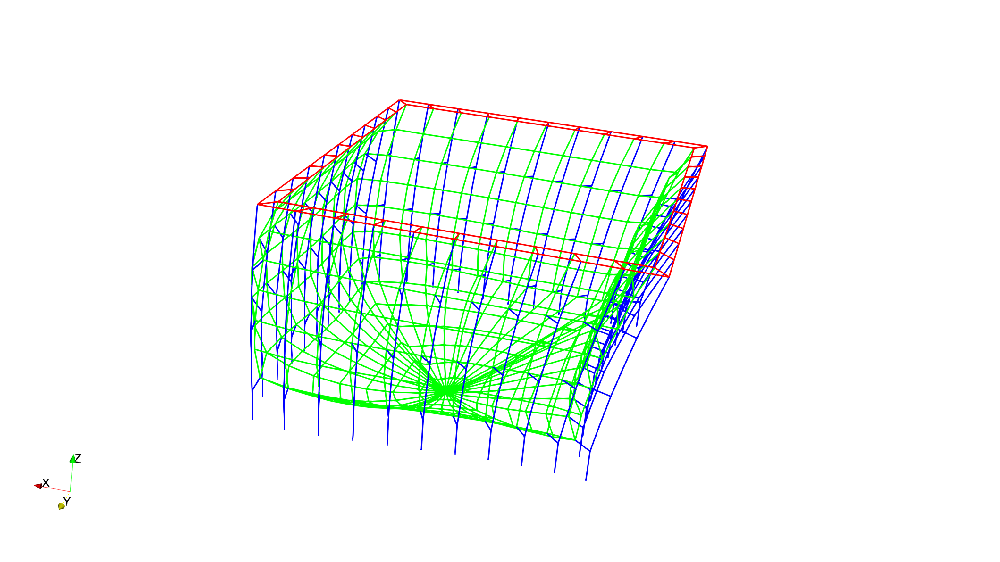

# How to set up a case

If you successfully run the [first case](./../Example/README.MD), you may want to change some parameters and give another try.

The following parameters are you can change for simulations (You may change more setting, but we recommend you start with the following parameters).
These parameter is stored at the [setting.json](./../Example/setting.json) file.

* Environment:

> **current** [m/s]  | define the current velocity by a vector [ux, uy, uz]. e.g. [0.5,0,0].
>
> **fluidDensity** [kg/m^3] | define the fluid density. e.g. for sea water 1025.

* CageShape:

> **origin** [**m**] | define the origin of a array of cages. If there is only cage, it still need to be a list pattern. e.g., [[0,0,0]] means one cage are set in the simulation and its floating collar center is [0,0,0]
>
> **cageCircumference** [m] | define the circumference of the fish cage. e.g. 120.
>
> **bottom_top_ratio**[ - ] | define the cage shrink ratio (from top to bottom). Usually in range of 0-1.  e.g. 1 means that the fish cage is a straight cage. 
>
> **cageHeight** [m] | define the cage height from water surface to the side net bottom
>
> **cageConeHeight** [m] | define the cone shape part height
>
> **element_length** [m]  |define the length of one line element.

* Frame

> **topring_sec_dia** [m] | define the section diameter of the floating collar.
>
> **topring_thickness** [m] |define the thickness of the floating collar.
>
> **rope_dep** [m]|define the length of rope that longer than the cage Height, e.g., 3 means that the total length of side rope is 3+ cageHeight.
>
> **rope_sec_dia** [m]| define the diameter of rope
>
> **weight_tip** [N] |define the weight at the center of the bottom netting
>
> **weight_per_metter**[N/m] | define the weight of the additional weight on the bottom edge of the fish cage.

* Net

> **Sn** [ - ] | Solidity of netting, usually between 0.1-0.4 for aquaculture nettings.
>
> **twineDiameter** [m] | diameter of an actual twine.
>
> **meshLength** [m] | length of a mesh for an actual netting.
>
> **netYoungmodule** [Pa] | Young's module for the material of netting
>
> **netRho** [kg/m^3] | define the netting material. e.g. for Nylon netting 1140.

