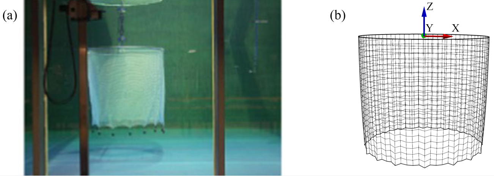

## Mesh generator for fish cages

The mesh generator is written in python to help to generate the [MED](https://www.salome-platform.org/user-section/about/med) mesh file for code_aster.

In the ```src/mesh``` folder, we provide mesh generator for five commonly used fish cages, namely, [CCS](../src/mesh/CCS.py), [CCT](../src/mesh/CCT.py), [CSM](../src/mesh/CSM.py), [CST]((../src/mesh/CST.py)), [SSM]((../src/mesh/SSm.py)).

***We do not recommend to modify the source code for mesh generator.***


## Rule of thumb for the mesh

There are few rules to make the mesh generation easy.

1. The water level is at Z = 0 m. 
2. Th water is the domain Z < 0. 
3. The floating collar is located at the water level.





