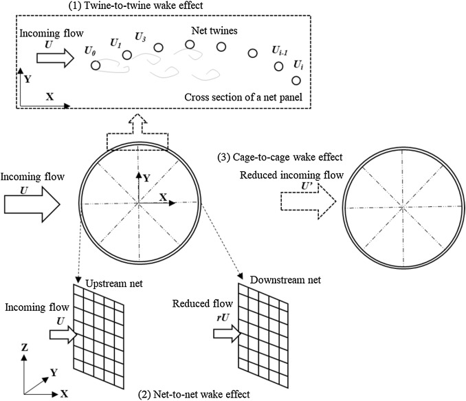
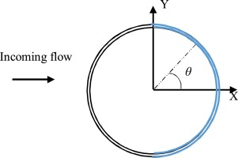

## wake effects

### What are the wake effects?

Wake effects are essential and complex in analyses of permeable structures, such as the nets in fish cage and fishing gear. The wake is the region of disturbed flow (often turbulent) downstream a structure, caused by the viscosity of the fluid. In a fish cage, wake effects means that the presence of upstream nets modifies the incoming flow velocity for downstream nets. In structural analyses of fish cages, the solver calculates the equilibrium between the external and internal forces of the structure and neglects the fluid mechanics. Therefore, the hydrodynamic forces on the downstream nets can be overestimated if no special precautions are taken to include the wake effect.

Illustration of different wake effects can be found in the following figure.

(1) Twine-to-twine wake effect, where a grid of *i+1* cylinders (cross-section of a net panel) are exposed to an incident current velocity *U*. The *Ui* (*i* = 0, 1 …) denotes the velocity experienced by cylinder *i*, which is modified due to the presence of upstream cylinders.

(2) Net-to-net wake effect, where the upstream (left) net panel is exposed to an incoming current velocity *U*. The net-to-net wake effects from the upstream net panel result in a reduced flow (*rU*) at the downstream net. 

(3) Cage-to-cage wake effect, where the incoming flow for the downstream (right) fish cage is anisotropic and might be smaller than the incoming flow for the upstream (left) fish cage.




### How to deal with the wake effects?

#### Twine-to-twine wake effect

The twine-to-twine wake effect represents the interactions between net twines (the influence region is in the order of centimetres). In a net panel, the velocity of the downstream twine is smaller than that of the upstream twine when the inflow angle of the net plane is larger than 70°. When the inflow angle is 90°, the drag force on a net panel without twine-to-twine wake effect can be maximumly eight times larger than that with twine-to-twine wake effect.The twine-to-twine effect is naturally included in two dimensional hydrodynamic models, since the hydrodynamic coefficients of net panels already consider the interactions between twines implicitly. Thus, we recommend to use the two dimensional hydrodynamic models for the nettings.

#### Net-to-net wake effect

The net-to-net wake effect is used to represent the interaction between nets inside a single fish cage (the influence region is in the order of tens of metres). Approximately half of the nets in a cylindrical fish cage will experience the net-to-net wake effect. This wake effect is implemented in ```/src/hydroModules/wake_effect.py```. The following is the equation for calculate the flow reduction factor *r*.


=\max(0,\frac{\cos\theta%2B0.05-0.38Sn}{0.05%2B\cos\theta}))  
 <!-- %2B is the + -->



#### Cage-to-cage wake effect
The cage-to-cage wake effect is used to represent the interaction between cages (the influence region is in the order of a few hundred metres). In the marine aquaculture industry, fish cages are usually grouped in arrays as a fish farm. Due to the block effect of the upstream cage, the flow for the downstream cage is affected by the existence of the upstream cage.

**This wake effect is not implemented in the present version.**